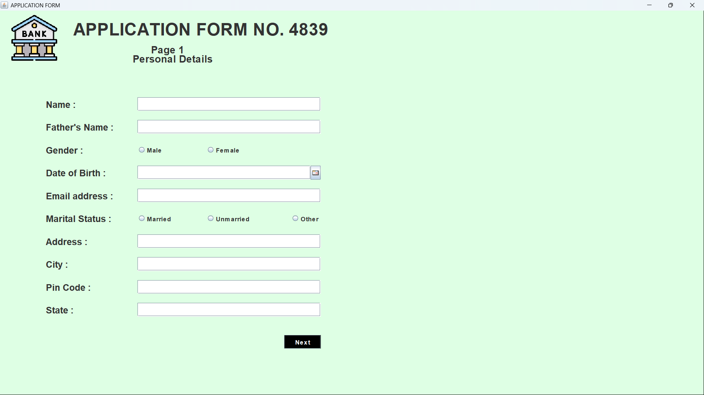
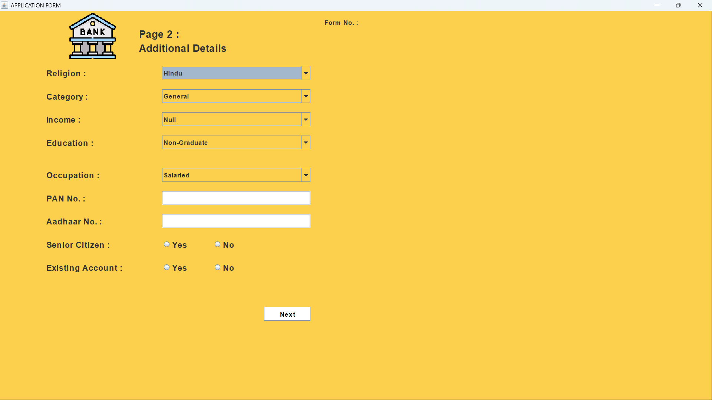
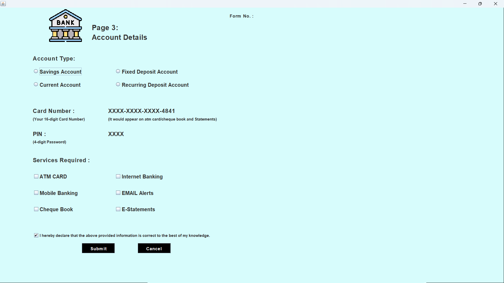
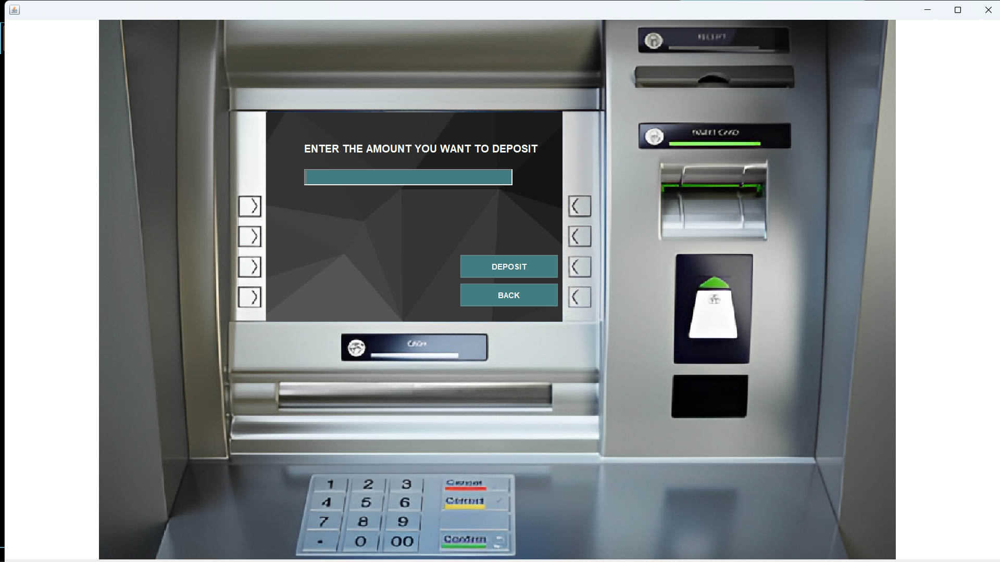
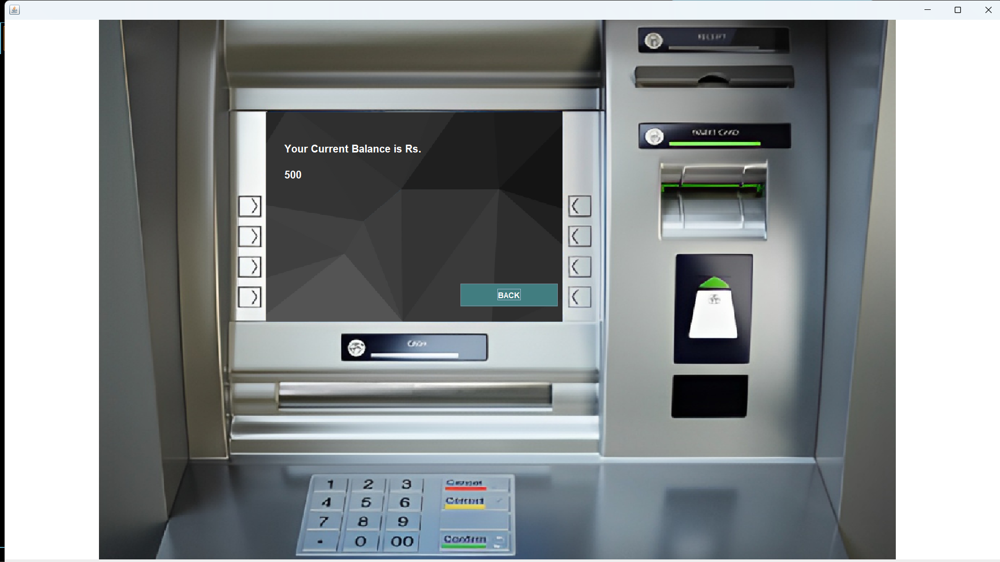
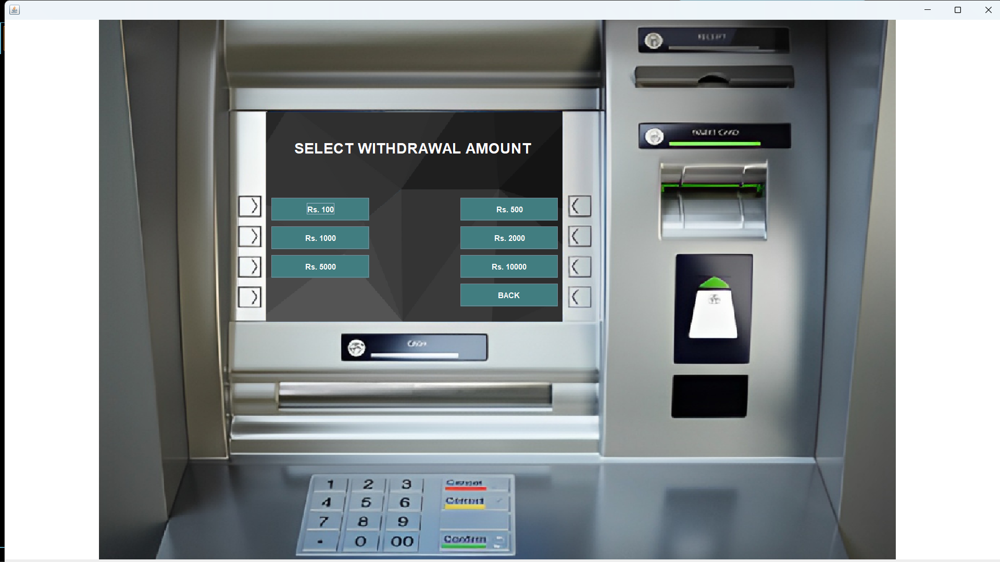
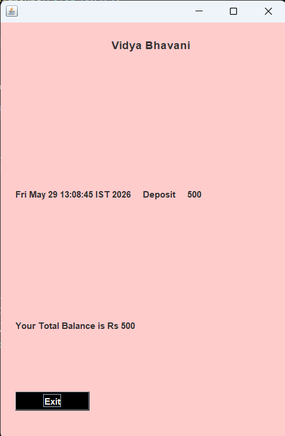

#  Bank Management System

A desktop-based **Bank Management System** developed using **Java**, **Java Swing**, **JDBC**, and **MySQL**. This project simulates the basic functionalities of an ATM, allowing users to create an account, log in securely, and perform banking transactions through a graphical user interface.

---

##  Features

*  Three-step account registration
*  User login using Card Number and PIN
*  Automatic Card Number and PIN generation
*  Deposit money
*  Cash withdrawal
*  Fast Cash withdrawal
*  Balance enquiry
*  Mini statement with transaction history
*  Change ATM PIN
*  MySQL database connectivity using JDBC
*  Interactive GUI built with Java Swing

---

##  Technologies Used

* Java
* Java Swing
* JDBC
* MySQL
* MySQL Connector/J
* JCalendar

---

##  Project Structure

```
BankManagementSystem
│
├── bank/
│   └── management/
│       └── system/
│           ├── login.java
│           ├── signup.java
│           ├── signup2.java
│           ├── signup3.java
│           ├── main_Class.java
│           ├── deposit.java
│           ├── withdrawal.java
│           ├── fastCash.java
│           ├── balanceEnquiry.java
│           ├── mini.java
│           ├── pin.java
│           └── conn.java
│
├── icon/
├── lib/
├── database.sql
└── README.md
```

---

##  Application Workflow

```
Login
   │
   ├── Existing User
   │       │
   │       ▼
   │   Main Menu
   │       ├── Deposit
   │       ├── Withdrawal
   │       ├── Fast Cash
   │       ├── Balance Enquiry
   │       ├── Mini Statement
   │       ├── Change PIN
   │       └── Exit
   │
   └── New User
           │
           ▼
     Signup (Page 1)
           │
           ▼
     Signup (Page 2)
           │
           ▼
     Signup (Page 3)
           │
           ▼
  Card Number & PIN Generated
           │
           ▼
      First Deposit
           │
           ▼
        Main Menu
```

---

##  Database

The project uses **MySQL** as the backend database.

Tables used:

* signup
* signuptwo
* signupthree
* login
* bank

A `database.sql` file is included to create the required tables.

---

##  How to Run

1. Clone this repository.

```bash
git clone https://github.com/VIDYABHAVANI07/BankManagementSystem.git
```

2. Open the project in your preferred Java IDE (VS Code/Eclipse/IntelliJ).

3. Create a MySQL database.

```sql
CREATE DATABASE bankSystem;
```

4. Import the `database.sql` script.

5. Update the database username and password in `conn.java`.

```java
connection = DriverManager.getConnection(
    "jdbc:mysql://localhost:3306/bankSystem",
    "your_username",
    "your_password"
);
```

6. Add the required libraries:

* mysql-connector-java
* jcalendar

7. Run `login.java`.

---


## Screenshots

### Login


### Signup - Page 1


### Signup - Page 2


### Signup - Page 3


### Main Menu


### Deposit


### Withdrawal


### Balance Enquiry


### Fast Cash


### Mini Statement

---

##  Future Improvements

* Password hashing
* PreparedStatement for secure SQL queries
* Improved input validation
* Money transfer between users
* Transaction search and filters
* Better UI design
* Admin dashboard

---

## 👩 Author

**Vidya Bhavani**

Final Year Computer Science Engineering Student

GitHub:
https://github.com/VIDYABHAVANI07
